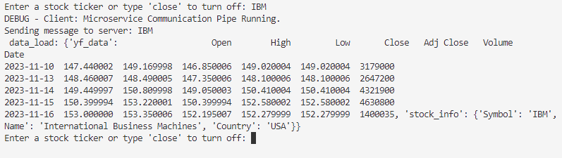
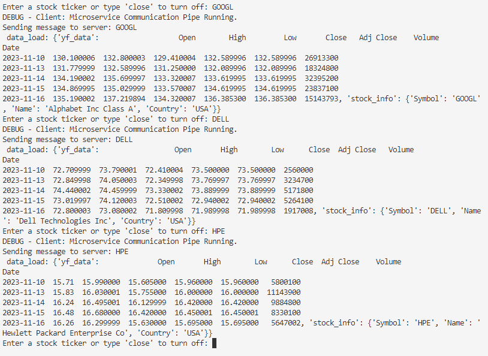
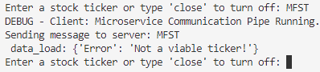
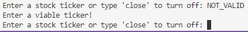
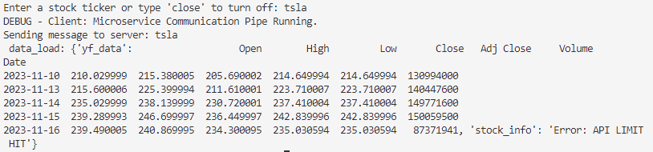
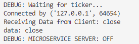
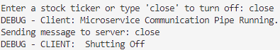

# 361-microservice
A microservice that will return stock information. This microservice uses python's socket module as a communication pipe. There are extra print statements to show that the microservice is running. If they are unnecessary, they can be commented.

## 2A. HOW TO REQUEST DATA:
  1. First get an api key for the server from https://www.alphavantage.co/ .
Click on 'GET FREE API KEY' and fill out the data. If there are issues, I can give my partner my api key.
2. When creating a client file, make sure that these modules are imported.
```
import socket
import json
import pickle
```
  3. Start the microservice's server and client files by typing the following into two separate terminals.
```
python server.py
```
```
python client.py
```
  4. Once the two processes are running, the server is waiting for instructions from the client and the client asks for an input stating: 'Enter a stock ticker or type 'close' to turn off:'. There are two possible things to put in the client's input: a ticker or the word 'close'.
  5. If the user types 'close', the client will send it to the server and it will turn off the server and client processes. However, if the client is given a stock ticker, the server will verify if the ticker is a valid ticker.

## 2B. HOW TO RECEIVE DATA:
1. The server file should have these modules imported along with the api key from alpha vantage.
```
import requests
import socket
import yfinance as yf
import json
import pickle
API_KEY = <API_KEY>
```
2. Once the server receives a ticker, it will verify if the ticker is a valid ticker or not.
3. The server will then format result either as an error or stock information and send it back to the client.
4. The client will receive a result in dictionary format using the pickle module. 

## 2C. UML SEQUENCE DIAGRAM:


## EXAMPLES OF RUNNING MICROSERVICE:
### SUCCESSFUL RUN:
Single Run:
<br>


Multiple Runs:
<br>


### TICKER NAME TOO LONG ERROR:
<br>



### INVALID TICKER ERROR:
<br>



### API LIMIT ERROR: 
yfinance data will be returned but the api data will show an error message. 
<br>


### CLOSE MICROSERVICE
server.py
<br>


client.py
<br>



